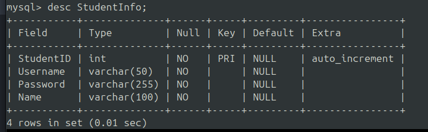
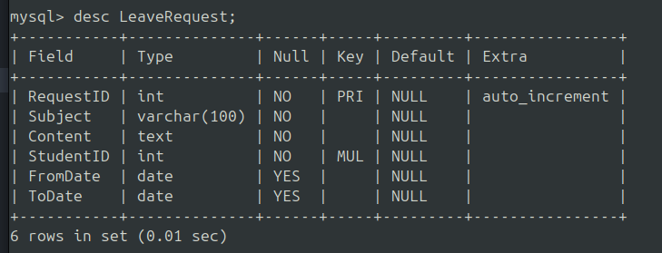
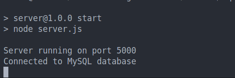

# student_mngmt_server
1. clone this repository
2. Inside the directory run    `npm install`
3. Make changes in .env file accordingly
4. Create a Database named `studentmanagement` 
5. Use `studentmanagement` and create two table named `LeaveRequest` and  `StudentInfo` with following columns;
    
    
5. Run npm start
6. Expected output
